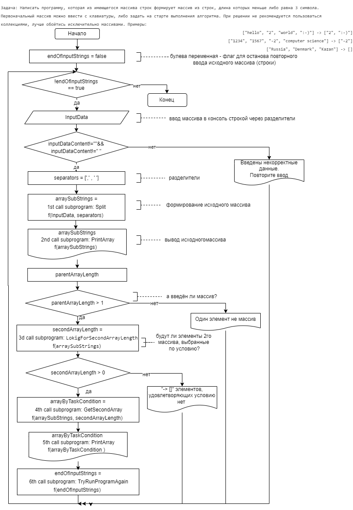

# Описание решения задачи

## Коротко: сформировать массив строк из имеющегося (т.е. на основе первого), удовлетворяющего условию задачи

### **Задача**
*Написать программу, которая из имеющегося массива строк формирует массив из строк, длина которых меньше либо равна 3 символа. Первоначальный массив можно ввести с клавиатуры, либо задать на старте выполнения алгоритма. При решении не рекомендуется пользоваться коллекциями, лучше обойтись исключительно массивами.*
.
### **Примеры**:
["hello", "2", "world", ":-)"] -> ["2", ":-)"]

["1234", "1567", "-2", "computer science"] -> ["-2"]

["Russia", "Denmark", "Kazan"] -> []

### **Логика выполнилнения**:
* Предоставил ввод пользователю массива через консоль с разделителям (пробел или запятая)
* Использовал встроенный метод "Split" библиотеки dotnet для разделения строки на подстроки, где модификатор позволяет удалять повторяющиеся пробелы (учтён составной разделитель "запятая+пробел или многопробелов") StringSplitOptions.RemoveEmptyEntries)
* Далее проверял - получили ли массив (больше одного элемента)
* После методом LokigForSecondArrayLength определил длину второго массива, формируемого по условию задачи
* Если такой массив возможен, через метод GetSecondArray создаём его втрой раз просматривая элементы исходного массива. Выводи его в консоль
* Если пользователь захочет продолжить выполнение программы, то введёт да (регист букв не важен) 

### **Приложения к репозиторию**:

1. "Блок-схема решения задачи.drawio" и "Блок-схема решения задачи.png" - блок-схемы, с подробными комментариями
2. "Контрольная работа.md" и "Контрольная работа.png" - задание контрольной работы
3. "Program.cs" - листиг на языке C# к блоксхеме п. 1

### Вложенная блок-схема

